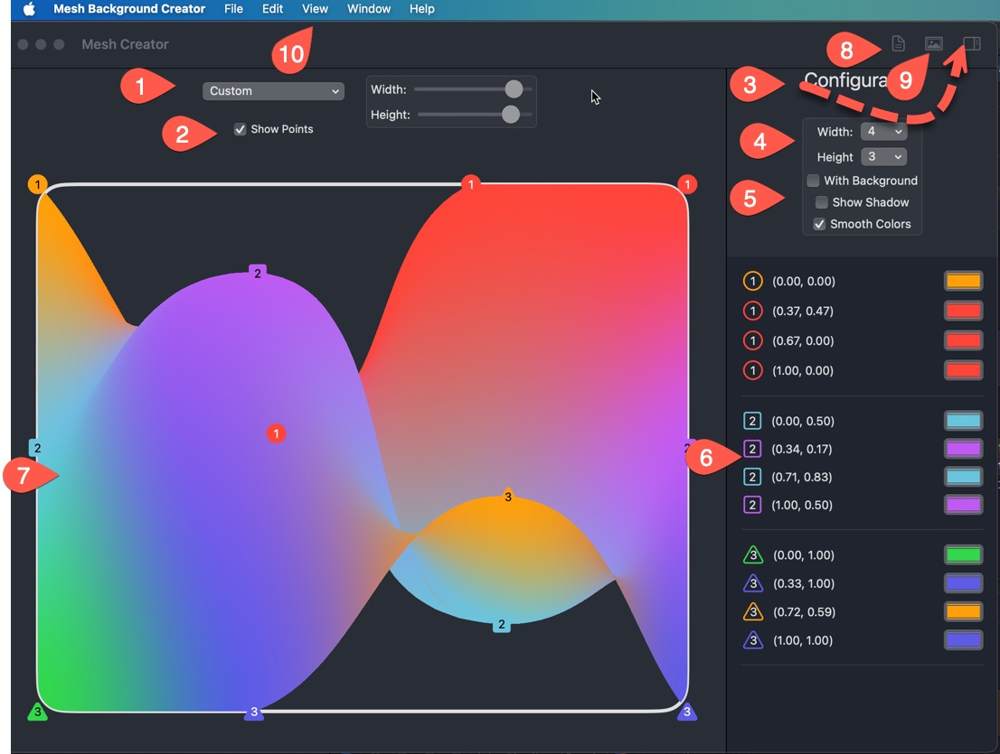

#  About this project

This is a demo project to demonstrate the new **MeshGradient** view that was introduced at WWDC 24 for iOS 18, MacOS 15 and requires Xcode 16 or higher to compile and run.

It is a multi platform application with two targets, one for iOS and one for MacOS.

> **Note:** If you are going to be testing the MacOS target, you will need to be running MacOS 15 (Sequoia) or higher.  As Xcode 16 will not build an app for an OS that is less than that.  
>
> To test the iOS target (on iPhone or iPad) you can be running MacOS 16 (Sonoma) with Xcode 16 installed.

### About the application

The application uses shared code for all targets using compiler directives to modify the code for the particular target OS.  Functionality is identical on all targets with one exception.

On MacOS, the "Save desktop Image" button will ask you to choose a location and a JPG image will be save to that location.

On iOS and iPadOS, the "Save desktop image" button will add the desktop image to your photo library.

## iOS/iPadOS

## macOS

1. **Display Selection:** This selector will allow you choose a view that represents either an iPhone/iPad device or one of any custom dimension.  This is purely for your convenience as the MeshView is dynamic and will scale to meet the dimensions of whatever view you apply it to.

2. You can remove the point markers on the display for viewing purposes.  They are never used in the actual MeshView displayed or the Desktop image produced

3. **Inspector/Config**.  On an iPad and MacOS. The inspector is displayed at the right by default.  It can be dismissed by tapping the inspector button.  On an iPhone or when an iPad is compressed then the sidebar button changes to a gear icon and the config is displayed as a modal sheet.

4. The **Width and Height** determine the number of bezier points horizontally and vertically.

5. If you adjust the bezier points inside the view as you see in the in the macOS image above, you can you can either apply a shadow on the MeshGradient view so that it stands out over the background, or you can have a different coloured background

6. The width X height determines the number of bezier points.  The points are placed in a coordinate system that is between 0 and 1 both horizontally and vertically.  Each point can be assigned a different color.  As you drag the points on the canvas, the point coordinates will changes.  Tapping or clicking on one of the colors will bring up a color picker

7. The display canvas will show you your MeshGradient. The gradient will adjust depending on the size determined by 1 above.

8. Tapping or clicking on the toolbar button will bring up a modal sheet with the SwiftUI code for generating the displayed MeshGradient View.  This code can be copied and used in your own SwiftUI applications to display the same MeshGraident view

   **Note:** The size of the display image is irrelevant.  The MeshGradient coordinate system is always 0...1 both vertically and horizontally.

9. Tapping on the **Desktop Image** icon will generate a desktop jpg image that is 1920 X 1080.  In iOS and iPadOS, the image will be saved to your photo album.  In MacOS, you will be ask to provide a name and save location.

10. On MacOS, the buttons in the toolbar have corresponding menu options and keyboard shortcuts.
